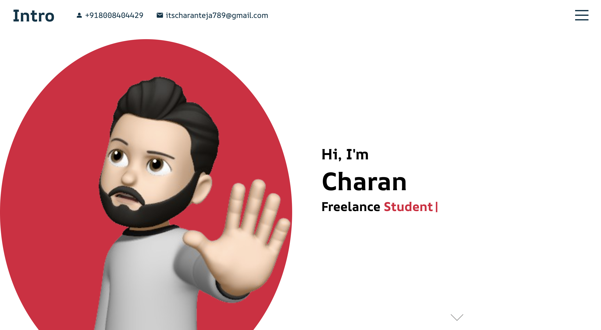
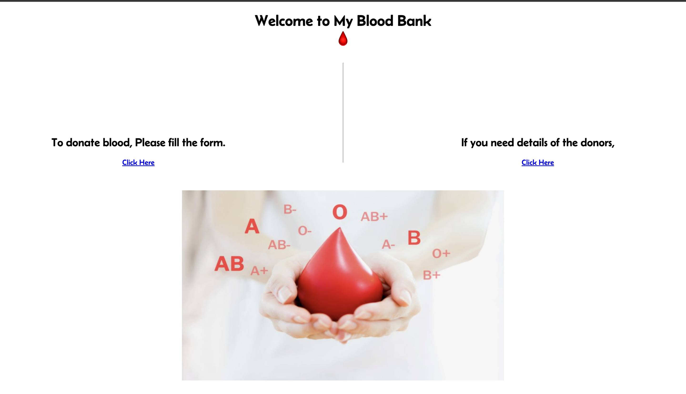
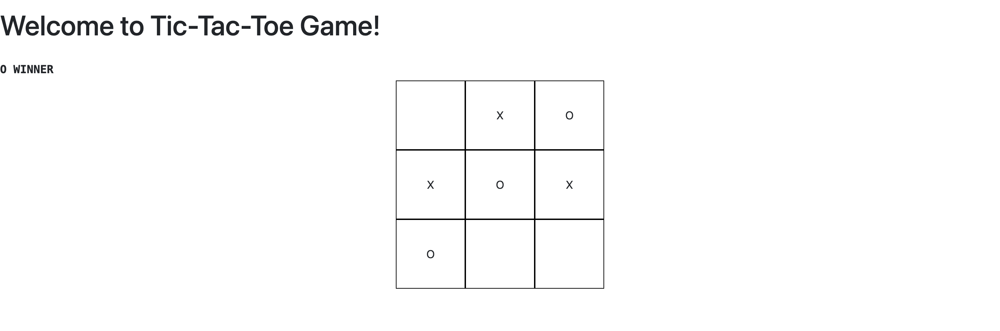

# My Portfolio

Welcome to my portfolio, built using React.js. This repository showcases my web development skills and the projects I've worked on. Here, you'll find information about me, my projects, and how to contact me.

## About Me

I'm Charan, a passionate web developer with a focus on front-end development. I specialize in building modern, responsive web applications using technologies like React, HTML, CSS, and JavaScript.

## Projects

### Project 1: [Personal Portfolio](https://itscharanteja.github.io/personal-portfolio/#portfolio)

This is my portfolio based on my skill based work.

### Project 2: [Blood Bank](https://github.com/itscharanteja/BloodBank)

This project is my internship project based blood donors information. This website is build using HTML, CSS, JS.

### Project 3: [Tic-TAc-Toe](https://github.com/itscharanteja/Tic-Tac-Toe-React)

This is simple web game called Tic-Tac-Toe or also known as XO Game.

## Skills

- HTML5
- CSS3
- JavaScript
- React.js
- Git/GitHub
- Responsive Design
- UI/UX Design

## Contact

Provide information on how people can reach out to you:

- **Email:** [itscharanteja789@gmail.com](mailto:itscharanteja789@gmail.com)
- **LinkedIn:** [LinkedIn Profile](https://www.linkedin.com/in/charan-sri-teja-b-a386a5225/)
- **GitHub:** [GitHub Profile](https://github.com/itscharanteja)
